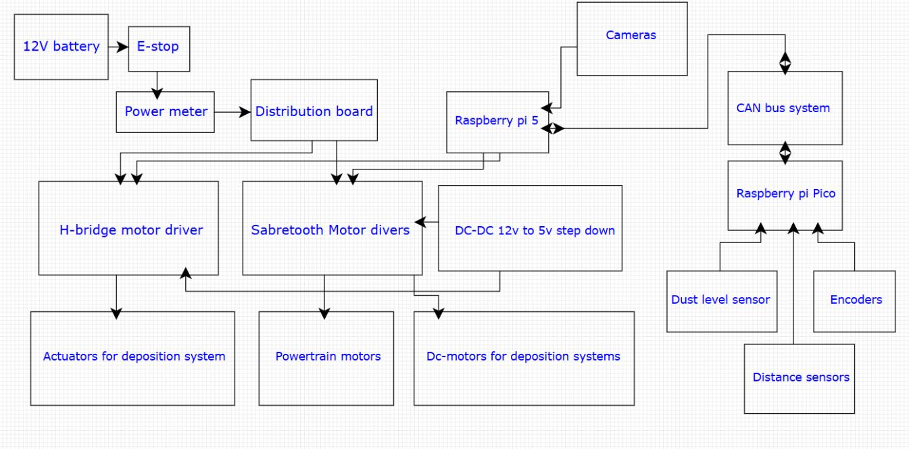
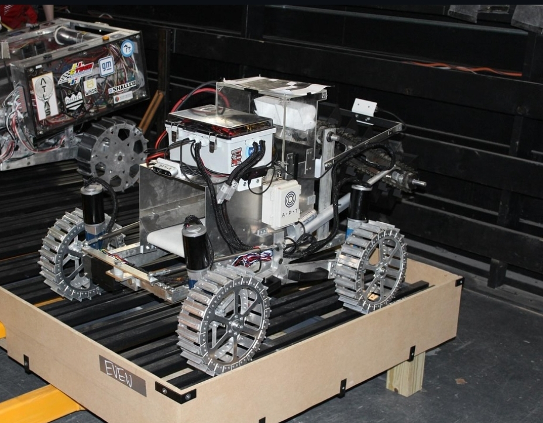
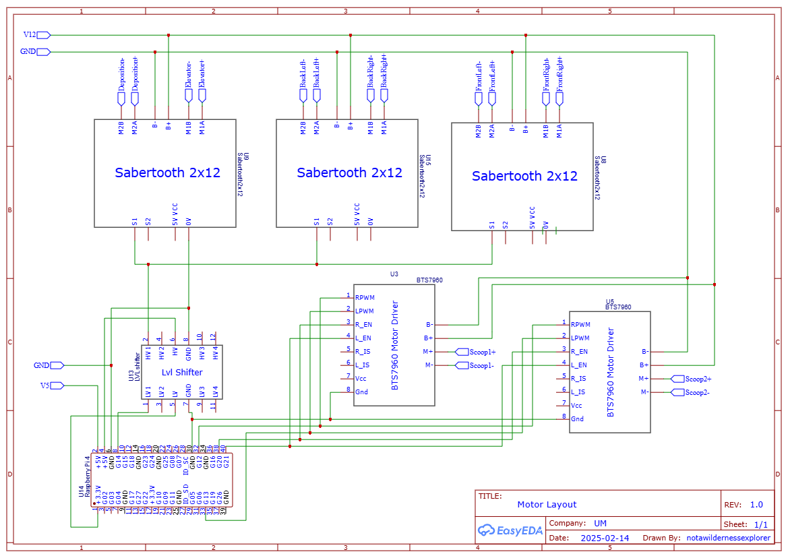

# ASME-electrical-team
Motor drivers and serial communication
Encoders and CAN modules and Picos 
Overview
motors and decisions for the gear box
Presenting Circuit diagrams 
some cad stuf

# 🚀 NASA Lunabotics 2024 – Electrical Subsystem

Welcome to the official repository for the electrical subsystem of the University of Miami’s ASME Lunabotics team for the **2024 NASA Lunabotics Competition**.

---

## 📚 Table of Contents

- [Project Overview](#project-overview)  
- [Achievements](#achievements)  
- [Responsibilities](#responsibilities)  
- [Electrical System Architecture](#electrical-system-architecture)  
- [CAN bus](#CAN-bus)
- [How to Run](#how-to-run)  
- [Motor drivers](#Motor-drivers)  
- [License](#license)

---

## 📌 Project Overview

This project highlights my role as the **electrical co-lead** of the University of Miami’s **ASME Lunabotics team** for the **2024 NASA Lunabotics Competition** — a nationally recognized challenge that tasks university teams with designing and building autonomous lunar excavators capable of navigating and collecting regolith in a simulated lunar environment.

Without hesitation, the **2024 season marked a pivotal turning point** for our team. We built multiple subsystems entirely from scratch, including the complete **electrical subsystem**.

We prioritized **simplicity and reliability**, focusing on minimizing points of failure while ensuring robust performance in harsh simulated lunar conditions. The rover operated flawlessly during competition.

---

## 🏆 Achievements

- 🏅 **Leaps and Bounds Award** – For significant improvements in systems engineering  
- 🥉 **3rd Place in Presentation and Demonstration**  
- ⚡ **Most Energy-Efficient Team**


---

## 🔌Electric Architecture
<p align="center">
  
</p>

---


## 🔌 The rover
<p align="center">
  
</p>
<p align="center">
  <b>NASA Lunabotics 2024 – Fully Assembled Rover</b><br>
  <a href="2024-2025/assets/">📸 See More Photos</a>
</p>

Key components included:

- 12V Li-ion Battery Pack  
- Custom PCBs with regulated 5V/3.3V rails  
- CAN Bus topology for subsystem communication  
- Motor drivers (e.g., BTS7960 or others)  
- Microcontroller (e.g., STM32 / Arduino / Teensy)  
- Sensors: IMU, encoders, limit switches, voltage/current monitors

---

## 💻 CAN bus system

What is the CAN bus and why we need it ?


The Controller Area Network (CAN) bus is a communication protocol designed for real-time data exchange between electronic devices over a single pair of wires called CAN LOW and the other called CAN HI. Unlike traditional point-to-point serial communication, CAN uses a multi-master architecture where each node (or device) can transmit and receive messages without a central host. Messages are prioritized by IDs, enabling critical data to take precedence during high-traffic periods. CAN also includes error-checking mechanisms like CRC and automatic retransmission, ensuring communication integrity even in electrically noisy environments.  In our rover, the CAN bus linked the **Raspberry Pi** to multiple** Raspberry Pi Pico**, enabling efficient communication of data from sensors and motor encoders. We used CAN bus to reduce the computational load on the main microcontroller, allowing us to distribute this load on multiple nodes. In addition, the CAN bus allowed us to reduce the wire complexity. We used the CAN module **MCP2515** that communicates with the microcontrollers via the SPI and then sends the data through the CAN H and CAN L wires.

Schematics

Code..
---

## 💻 Motor drivers (Sabertooth)
One of the challenges we faced was the voltage incompatibility between the **Raspberry Pi**, which operates at 3.3V logic, and the Sabertooth motor driver, which requires 5V logic for reliable serial communication. In the 2023 competition, the team addressed this issue by routing control signals through an **Arduino**, which acted as a 5V buffer. While this worked, it introduced unnecessary complexity and potential communication delays. To make the system simpler and reduce the points of failure, we transitioned to using compact **bi-directional logic level converters (BSS138)**, allowing us to safely and efficiently shift the 3.3V signals up to 5V. This solution maintained signal integrity and enabled direct communication between the Pi and the Sabertooth.

<p align="center">
  
</p>

To test the motors, we wrote a script using the `pysabertooth` library. Each Sabertooth was initialized with a unique address. This script demonstrates safe testing under current limitations and includes logic for bidirectional control.

### 🔧 Sample Code Snippet

```python
from pysabertooth import Sabertooth

# Initialize Sabertooth motor driver on address 128
motor1 = Sabertooth("/dev/serial0", baudrate=9600, address=128)
motor1.open()
motor1.drive(1, 60)  # Drive motor 1 at 60% power
motor1.drive(2, 60)  # Drive motor 2 at 60% power
```

👉 View the full motor test script [here](Main%20codes/motor_testing.py)


---

## ▶️ How to Run

> _Instructions for replicating or simulating the system (if applicable)._

1. Clone the repository:
   ```bash
   git clone https://github.com/yourusername/nasa-lunabotics-2024-electrical.git


* A **diagram** or image of the electrical system
* Sections for **Setup**, **Hardware List**, or **Team Credits**
* A **"Tech Stack"** or component list (e.g., Arduino, CAN transceivers, motor drivers, etc.)

I'm happy to build out the full `README.md` with more sections if you'd like!
